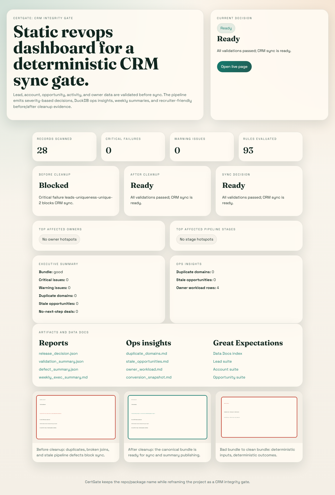
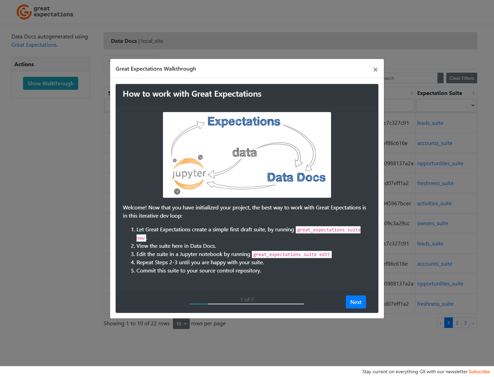
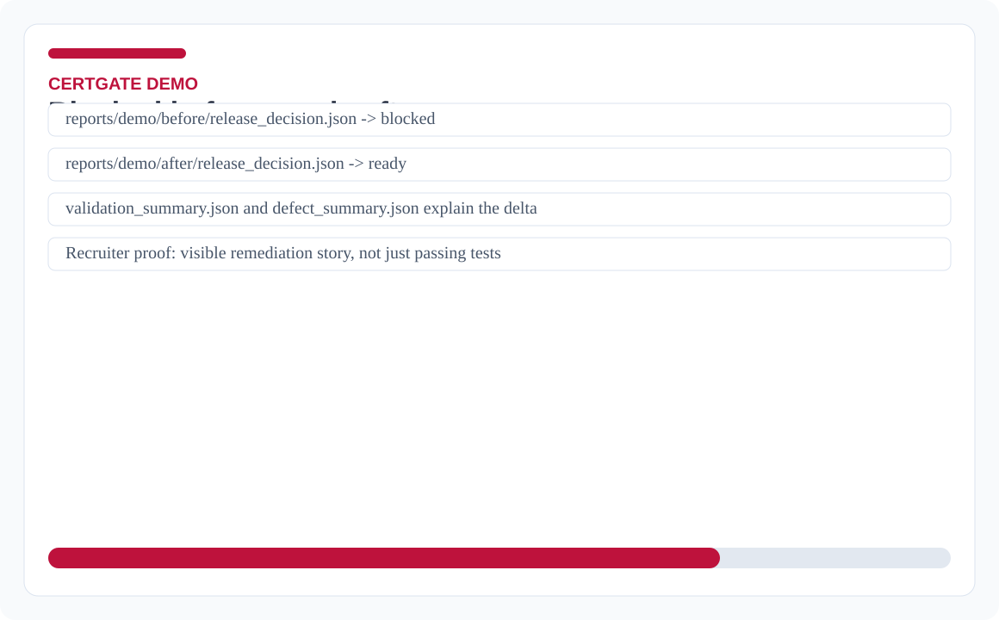
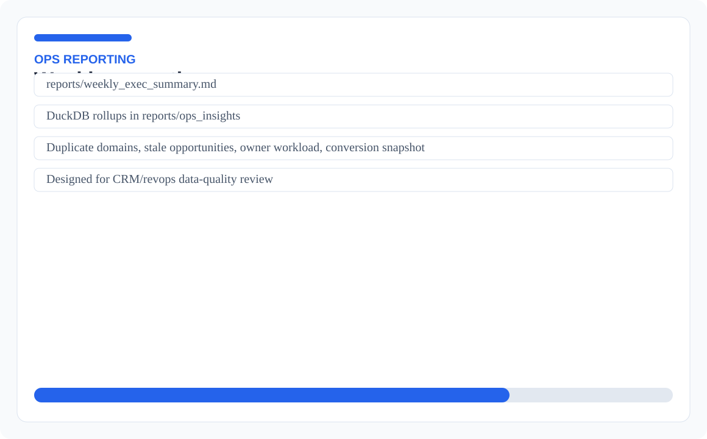

# CertGate: CRM Integrity Gate

CertGate is a CRM data-quality gate for validating leads, accounts, opportunities, activities, and owners before reporting or sync. It catches duplicates, broken joins, stale follow-up risks, invalid deal states, and missing firmographic data, then produces JSON, Markdown, Great Expectations Data Docs, DuckDB rollups, and a static dashboard. This project demonstrates Python data validation, SQL analytics, release gating, regression testing, generated reports, and CI/CD-backed portfolio evidence.

## Quick links
- **Live demo:** [static dashboard](https://josuejero.github.io/CertGate/) and [Great Expectations Data Docs](https://josuejero.github.io/CertGate/data-docs/)
- **Screenshots:** [dashboard](demo-site/assets/screenshots/static-dashboard.png), [Data Docs](demo-site/assets/screenshots/gx-data-docs.png), [before/after report](demo-site/assets/screenshots/before-after-report.svg), [weekly summary](demo-site/assets/screenshots/weekly-exec-summary.svg)
- **Test report:** `reports/junit.xml` and `python -m pytest -q`
- **CI workflow:** `.github/workflows/ci.yml`
- **Architecture docs:** `docs/business-rules.md`, `docs/rule-severity-matrix.md`, `docs/test-plan.md`
- **Main code to inspect:** `src/`, `scripts/generate_release_reports.py`, `sql/`, `reports/`

## Employer scan
**Best fit roles:** Data Quality Engineer, Analytics Engineer, QA Automation Engineer, RevOps Data Analyst  
**Core stack:** Python, DuckDB, Pandas, Great Expectations, PyTest, SQL, GitHub Pages  
**What this proves:** CRM data contracts, validation layers, SQL reporting, generated artifacts, regression coverage, release decisions  
**Start here:** `src/`, `sql/`, `scripts/`, `reports/ops_insights/`

## Visual proof
| Static dashboard | Great Expectations Data Docs |
| --- | --- |
|  |  |

| Before/after decision | Weekly executive summary |
| --- | --- |
|  |  |

## Overview
- **Integrity gate:** blocks bad CRM bundles when duplicates, broken owner/account/activity joins, or invalid open-deal states appear.
- **Deterministic reporting:** produces `reports/validation_summary.json`, `reports/defect_summary.json`, `reports/release_decision.json`, `reports/weekly_exec_summary.json`, and DuckDB-backed `reports/ops_insights/*`.
- **Recruiter-facing demo:** GitHub Pages serves the dashboard in `demo-site/`, the demo before/after artifacts under `reports/demo/`, and Great Expectations Data Docs under `/data-docs/`.
- **Regression-friendly build:** synthetic `good`, `bad`, and targeted `regression` bundles keep failure modes reproducible.

## CRM Data Contract
The canonical bundle lives in `data/good` and uses five CSVs:

| File | Columns |
| --- | --- |
| `leads.csv` | `lead_id, email, first_name, last_name, company_name, company_domain, job_title, owner_id, lead_source, lifecycle_stage, lead_status, created_at, last_activity_at, account_id` |
| `accounts.csv` | `account_id, account_name, company_domain, employee_count, industry, segment, owner_id, created_at, last_activity_at` |
| `opportunities.csv` | `opportunity_id, account_id, owner_id, stage, amount, created_at, close_date, last_stage_change_at, next_step, forecast_category` |
| `activities.csv` | `activity_id, object_type, object_id, activity_type, activity_at, owner_id, outcome` |
| `owners.csv` | `owner_id, owner_name, owner_email, team, manager, is_active` |

Ordered value systems:
- Lead lifecycle: `Subscriber`, `Lead`, `MQL`, `SQL`, `Opportunity`, `Customer`
- Opportunity stage: `Discovery`, `Qualification`, `Proposal`, `Negotiation`, `Closed Won`, `Closed Lost`
- Closed stages: `Closed Won`, `Closed Lost`

## Validation Layers
- **Schema/completeness:** required columns, non-null primary keys, parseable datetimes, numeric typing, and uniqueness checks.
- **Identity/dedupe:** duplicate lead email, duplicate account domain, duplicate opportunity ID, same email mapped to multiple accounts.
- **Referential integrity:** owner, account, and activity object references must resolve.
- **Business rules:** closed-won amount checks, close-date chronology, inactive owner on open opportunity, missing enterprise employee count, missing next step, stale stage age, missing recent touches, and lead/account domain mismatch.

Temporal checks are **bundle-relative**, not wall-clock relative. The pipeline derives a reference timestamp from the newest observed activity/stage timestamps in the loaded data so the demo remains stable over time.

## DuckDB Ops Insights
SQL lives in `sql`:
- `duplicate_domains.sql`
- `stale_opportunities.sql`
- `owner_workload.sql`
- `missing_firmographics.sql`
- `conversion_snapshot.sql`
- `weekly_exec_summary.sql`

Each query writes both JSON and Markdown into `reports/ops_insights`.

## Running It
Great Expectations `<0.18` remains limited to Python 3.10-3.13. On Python 3.14+ the GX script exits intentionally because the bundled Pydantic v1 dependency is still incompatible.

1. Bootstrap a supported environment: `PYTHON_CMD=python3.13 ./scripts/bootstrap.sh`
2. Activate it: `source .venv/bin/activate`
3. Generate full CRM artifacts: `python scripts/generate_release_reports.py`
4. Run Great Expectations/Data Docs: `python scripts/run_great_expectations.py`
5. Refresh demo visuals: `python scripts/generate_demo_assets.py`
6. Open the static dashboard: `demo-site/index.html`

The CLI still works through `python -m certgate` and keeps the existing package path unchanged.

## Repo Outputs
- Root artifacts: `reports/validation_summary.json`, `reports/defect_summary.json`, `reports/release_decision.json`
- Weekly summary: `reports/weekly_exec_summary.json`, `reports/weekly_exec_summary.md`
- Demo comparison: `reports/demo/before/release_decision.json`, `reports/demo/after/release_decision.json`
- Data Docs root: `gx/data_docs/local_site/index.html`

## Test Coverage
- Unit tests verify schema parsing, dedupe/integrity/business checks, reporting, and pipeline behavior.
- Functional tests validate the good bundle, generated artifacts, and the GX script when the interpreter is supported.
- Regression tests pin targeted failure scenarios under `data/regression`.
- UAT checks confirm the demo comparison remains “blocked before, ready after.”

Run the suite with `python3 -m pytest -q`.
